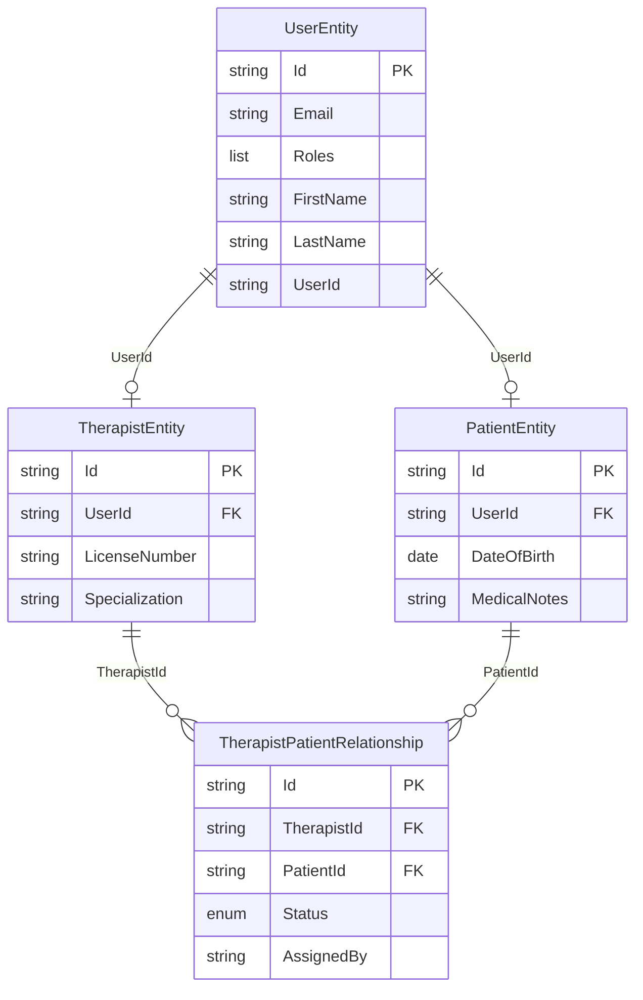

# Fuji36 User, Patient & Therapist Design Document

## 1. Introduction

### 1.1 Purpose

This document describes the data model and relationships between **User**, **Patient**, **Therapist**, and **TherapistPatientRelationship** in the Fuji36 physical therapy platform. It serves as the authoritative reference for developers implementing or extending these features.

### 1.2 Scope

- **Identity Service**: User authentication and profile storage
- **Planning Service**: Therapist, Patient, and relationship entities
- **Access control**: Role-based authorization rules

### 1.3 Glossary

| Term | Definition |
|------|------------|
| **User** | A person authenticated in the system. Stored in Identity service. |
| **Patient** | A user with role `patient` who receives therapy. Has a PatientEntity in Planning. |
| **Therapist** | A user with role `therapist` who provides therapy. Has a TherapistEntity in Planning. |
| **Admin** | A user with role `admin` who can manage therapists and patients. |
| **UserId** | `UserEntity.Id` (MongoDB `_id`) – primary identifier for a user in Identity. |
| **ExternalUserId** | `UserEntity.UserId` – optional external identifier for the user. |

---

## 2. Architecture Overview

### 2.1 Service Boundaries

```
┌─────────────────────────────────────────────────────────────────────────┐
│                         Fuji36 Platform                                  │
├─────────────────────────────────────────────────────────────────────────┤
│  Identity Service (Port 5001)          │  Planning Service (Port 5002)   │
│  ─────────────────────────────────    │  ─────────────────────────────  │
│  • UserEntity (auth, profile)          │  • TherapistEntity              │
│  • UserId (MongoDB _id)               │  • PatientEntity               │
│  • Roles: admin, therapist, patient    │  • TherapistPatientRelationship  │
└─────────────────────────────────────────────────────────────────────────┘
```

### 2.2 Data Ownership

| Entity | Service | MongoDB Collection |
|--------|---------|--------------------|
| UserEntity | Identity | (Identity DB) |
| TherapistEntity | Planning | `fuji36_therapists` |
| PatientEntity | Planning | `fuji36_patients` |
| TherapistPatientRelationship | Planning | `fuji36_therapist_patient_relationships` |

---

## 3. Entity Definitions

### 3.1 User (Identity Service)

**File**: `Fuji36.Identity/Models/UserEntity.cs`

The base identity entity. All authenticated users (patients, therapists, admins) exist as a UserEntity first.

| Field | Type | Description |
|-------|------|-------------|
| Id | string | MongoDB `_id` – primary key |
| Email | string | Login email |
| PasswordHash | string | Hashed password |
| Roles | List<string> | e.g. `["patient"]`, `["therapist"]`, `["admin"]` |
| FirstName | string? | Display name |
| LastName | string? | Display name |
| UserId | string? | Optional external identifier |
| AvatarUrl | string? | Profile image URL |
| CreatedAt | DateTimeOffset | Creation timestamp |

**Frontend roles** (`AuthContext.tsx`): `admin`, `user`, `guest`, `patient`, `therapist`

---

### 3.2 Therapist (Planning Service)

**File**: `Fuji36.Planning/Models/TherapistEntity.cs`

Extends a User via `UserId` (references `UserEntity.Id`). One User can have at most one TherapistEntity.

| Field | Type | Description |
|-------|------|-------------|
| Id | string | MongoDB `_id` – primary key |
| UserId | string | FK → `UserEntity.Id` (Identity) |
| LicenseNumber | string? | Professional license |
| Specialization | string? | e.g. PT, OT |
| PhoneNumber | string? | Contact |
| CreatedAt | DateTimeOffset | Creation timestamp |
| UpdatedAt | DateTimeOffset | Last update |

**Constraints**: Unique index on `UserId` – one therapist per user.

---

### 3.3 Patient (Planning Service)

**File**: `Fuji36.Planning/Models/PatientEntity.cs`

Extends a User via `UserId` (references `UserEntity.Id`). One User can have at most one PatientEntity.

| Field | Type | Description |
|-------|------|-------------|
| Id | string | MongoDB `_id` – primary key |
| UserId | string | FK → `UserEntity.Id` (Identity) |
| DateOfBirth | DateTime? | Date of birth |
| PhoneNumber | string? | Contact |
| Address | string? | Address |
| MedicalNotes | string? | Clinical notes |
| CreatedAt | DateTimeOffset | Creation timestamp |
| UpdatedAt | DateTimeOffset | Last update |

**Constraints**: Unique index on `UserId` – one patient per user.

---

### 3.4 TherapistPatientRelationship (Planning Service)

**File**: `Fuji36.Planning/Models/TherapistPatientRelationship.cs`

Join entity linking a Therapist to a Patient. Supports many-to-many: one therapist can have many patients; one patient can have many therapists.

| Field | Type | Description |
|-------|------|-------------|
| Id | string | MongoDB `_id` – primary key |
| TherapistId | string | FK → `TherapistEntity.Id` |
| PatientId | string | FK → `PatientEntity.Id` |
| Status | RelationshipStatus | Active, Inactive, Suspended |
| AssignedAt | DateTimeOffset | When assignment was made |
| AssignedBy | string? | UserId of admin/therapist who assigned |
| Notes | string? | Assignment notes |
| CreatedAt | DateTimeOffset | Creation timestamp |
| UpdatedAt | DateTimeOffset | Last update |

**RelationshipStatus enum**:

| Value | Meaning |
|-------|---------|
| Active | Relationship is active; therapist can access patient |
| Inactive | Relationship ended (soft delete) |
| Suspended | Temporarily paused |

**Constraints**:
- Unique compound index on `(TherapistId, PatientId)` – one relationship per pair
- Index on `(PatientId, Status)` for lookups

---

## 4. Entity Relationship Diagram

### 4.1 ERD (ASCII)

```
┌─────────────────────────────────────────────────────────────────────────┐
│                         UserEntity (Identity)                             │
│  Id (PK), Email, Roles[], FirstName, LastName, UserId, AvatarUrl         │
└─────────────────────────────────────────────────────────────────────────┘
         │
         │ 1:1 (UserId = UserEntity.Id)
         │
         ├──────────────────────────────────────────────────────────────────┐
         │                                                                  │
         ▼                                                                  ▼
┌─────────────────────────────┐                    ┌─────────────────────────────┐
│     TherapistEntity         │                    │      PatientEntity           │
│  Id (PK), UserId (FK)       │                    │  Id (PK), UserId (FK)       │
│  LicenseNumber, Specialization│                  │  DateOfBirth, MedicalNotes   │
└──────────────┬──────────────┘                    └──────────────┬──────────────┘
               │                                                  │
               │              many-to-many                        │
               │         (via TherapistPatientRelationship)       │
               └──────────────────────┬───────────────────────────┘
                                      │
                                      ▼
               ┌─────────────────────────────────────────────────────────────┐
               │              TherapistPatientRelationship                     │
               │  Id (PK), TherapistId (FK), PatientId (FK)                   │
               │  Status, AssignedAt, AssignedBy, Notes                        │
               └─────────────────────────────────────────────────────────────┘
```

### 4.2 Mermaid ERD



---

## 5. Data Flow & Access Rules

### 5.1 Authentication

- All API requests require `X-User-Id` header (set by API Gateway from JWT).
- `X-User-Id` = `UserEntity.Id` (Identity MongoDB `_id`).

### 5.2 Authorization

| Action | Allowed Roles |
|--------|---------------|
| Create Therapist | Admin (or any user with create permissions) |
| Create Patient | Admin (or any user with create permissions) |
| Get own Therapist | Therapist (self) |
| Get own Patient | Patient (self) |
| Get Therapist by Id | Therapist (self), Admin |
| Get Patient by Id | Patient (self), Assigned Therapist, Admin |
| List all Therapists | Therapist, Admin |
| List all Patients | Therapist, Admin |
| Assign Patient to Therapist | Therapist (self), Admin |
| Remove Relationship | Therapist (self), Admin |
| Get Therapist's Patients | Therapist (self), Admin |
| Get all Therapists with Patients | Admin only |

### 5.3 Relationship Lifecycle

1. **Create**: Admin or Therapist calls `POST /therapist-patient-relationships` with `TherapistId`, `PatientId`, optional `Notes`.
2. **Reactivate**: If relationship exists but is Inactive, assignment sets Status back to Active.
3. **Remove (soft delete)**: `DELETE /therapist-patient-relationships/{therapistId}/{patientId}` sets Status to Inactive.

---

## 6. API Reference

### 6.1 Therapists

| Method | Endpoint | Description |
|--------|----------|-------------|
| POST | `/therapists` | Create therapist (body: `CreateTherapistRequestDto`) |
| GET | `/therapists/{therapistId}` | Get therapist by Id |
| GET | `/therapists/user/{userId}` | Get therapist by UserId |
| GET | `/therapists` | List all therapists (therapist/admin only) |
| GET | `/therapists/{therapistId}/patients` | Get patients assigned to therapist |
| GET | `/therapists/with-patients` | Get all therapists with patients (admin only) |

### 6.2 Patients

| Method | Endpoint | Description |
|--------|----------|-------------|
| POST | `/patients` | Create patient (body: `CreatePatientRequestDto`) |
| GET | `/patients/{patientId}` | Get patient by Id |
| GET | `/patients/user/{userId}` | Get patient by UserId |
| GET | `/patients` | List all patients (therapist/admin only) |

### 6.3 Therapist-Patient Relationships

| Method | Endpoint | Description |
|--------|----------|-------------|
| POST | `/therapist-patient-relationships` | Assign patient to therapist (body: `AssignPatientToTherapistRequestDto`) |
| DELETE | `/therapist-patient-relationships/{therapistId}/{patientId}` | Remove relationship (soft delete) |

### 6.4 Request/Response DTOs

**CreateTherapistRequestDto**:
```json
{
  "userId": "string",
  "licenseNumber": "string?",
  "specialization": "string?",
  "phoneNumber": "string?"
}
```

**CreatePatientRequestDto**:
```json
{
  "userId": "string",
  "dateOfBirth": "string (ISO date)?",
  "phoneNumber": "string?",
  "address": "string?",
  "medicalNotes": "string?"
}
```

**AssignPatientToTherapistRequestDto**:
```json
{
  "therapistId": "string",
  "patientId": "string",
  "notes": "string?"
}
```

**TherapistDto**:
```json
{
  "therapistId": "string",
  "userId": "string",
  "licenseNumber": "string?",
  "specialization": "string?",
  "phoneNumber": "string?",
  "createdAt": "string (ISO)",
  "updatedAt": "string (ISO)"
}
```

**PatientDto**:
```json
{
  "patientId": "string",
  "userId": "string",
  "userExternalId": "string?",
  "firstName": "string?",
  "lastName": "string?",
  "avatarUrl": "string?",
  "dateOfBirth": "string (ISO date)?",
  "phoneNumber": "string?",
  "address": "string?",
  "medicalNotes": "string?",
  "createdAt": "string (ISO)",
  "updatedAt": "string (ISO)"
}
```

---

## 7. Appendix

### 7.1 Key ID Reference

| ID Type | References | Used In |
|---------|------------|---------|
| `UserEntity.Id` | Identity MongoDB `_id` | `TherapistEntity.UserId`, `PatientEntity.UserId`, `X-User-Id` header |
| `UserEntity.UserId` | Optional external ID | `PatientDto.UserExternalId` |
| `TherapistEntity.Id` | Planning MongoDB `_id` | `TherapistPatientRelationship.TherapistId` |
| `PatientEntity.Id` | Planning MongoDB `_id` | `TherapistPatientRelationship.PatientId` |

### 7.2 Related Entities

- **PlanEntity**: `PatientId`, `TherapistId` – links plans to patients and therapists
- **TaskEntity**: `PlanId` – tasks belong to plans
- **SessionEntity**: Tracks practice sessions (analysis, scoring)

---

*Document version: 1.0*  
*Last updated: February 2025*
